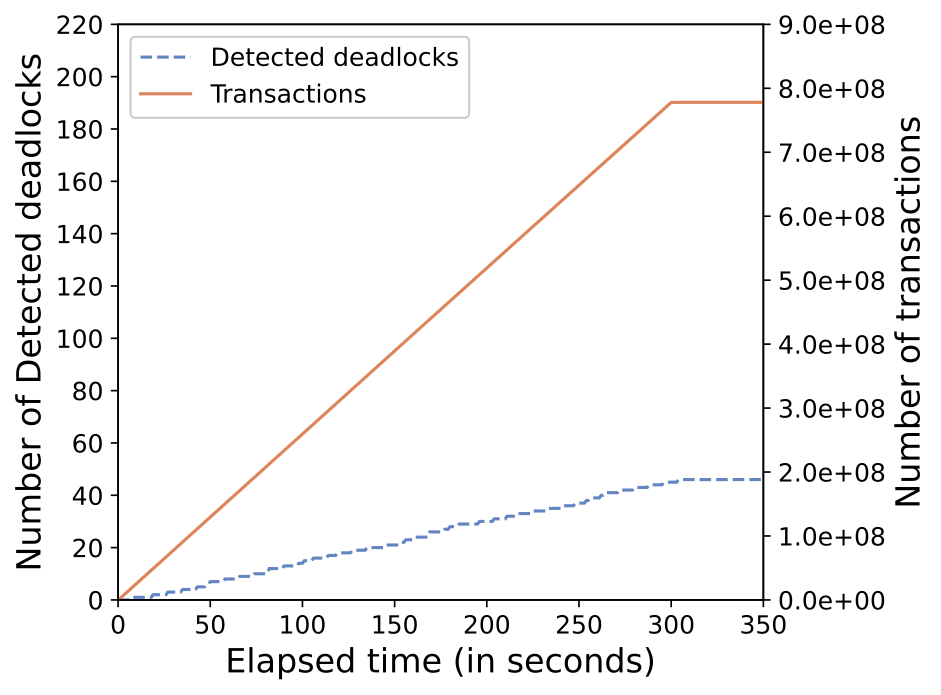
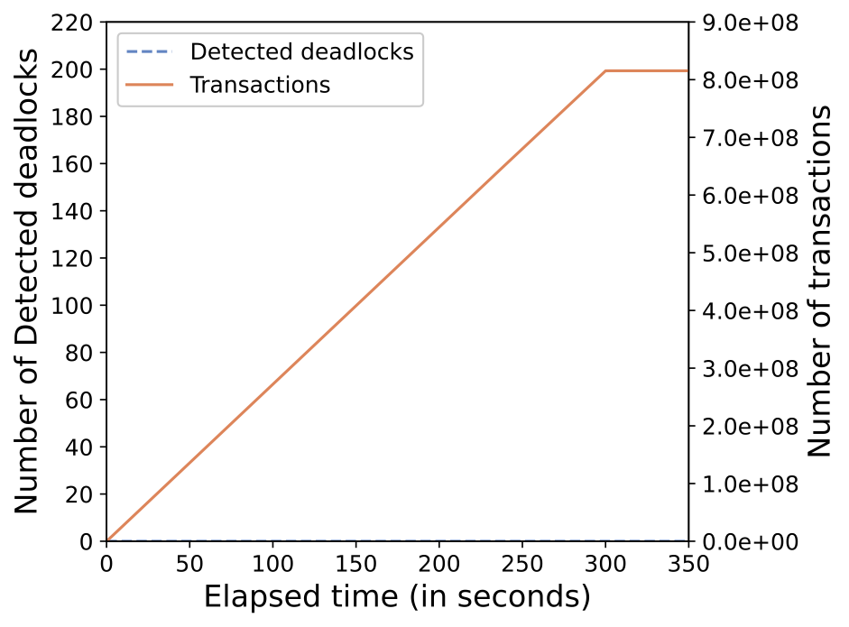
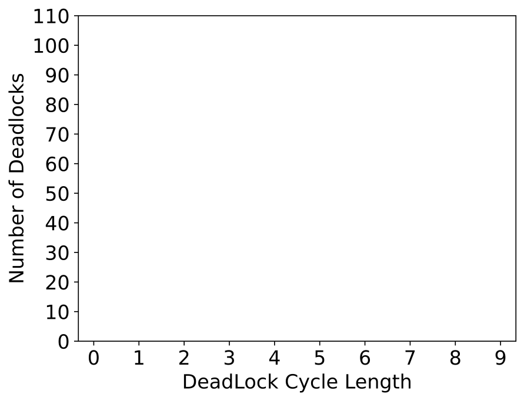

# Introduction to LCL Deadlock Detection and Resolution Modules

The code is divided into two parts:

`Doit_LCL_Graph_Commit`: the LCL deadlock detection and resolution code.

`python_code`: Generate the figures required for this paper based on experimental data.

## Doit_LCL_Graph_Commit

### Environment configuration

Required dependencies:

- cmake 3.2  

​        `sudo yum install cmake.x86_64 -b test`

```shell
yum search cmake -b test
sudo yum install cmake.x86_64 -b test
#The `cmake` after the author's installation is /usr/local/bin/cmake, so create a soft link.
# sudo ln -s  /usr/local/bin/cmake /usr/bin/cmake
```

### Compile

Note that we need to make four binary files: LCL_both_exps, LCL_SQL_exp_res_normal, LCL_SQL_normal_res_exp, LCL_both_normals 
after revising the LCL code.

```shell
mkdir build && cd build
cmake -DCMAKE_BUILD_TYPE=Release ..
make -j 8
mv LCL LCL_both_exps
#mv LCL LCL_SQL_exp_res_normal
#mv LCL LCL_SQL_normal_res_exp
#mv LCL LCL_both_normals
```

### Run

```shell
./LCL_both_exps 400
#./LCL_SQL_exp_res_normal 400
#./LCL_SQL_normal_res_exp 400
#./LCL_both_normals 400
```

## parameters

### Module information

`parameters.h`

### Module summary


For the convenience of system configuration, the adjustable parameters are placed in `parameters.h` management.

## System

### Module information

`system.h` `system.cpp`

### Module summary


Encapsulation of transaction class and resource class: the transaction class contains information required for deadlock detection.

### Module function

`void TransactionProcess::Run_SQL(std::vector<Resource *> &resource_pool)`:

Execute a piece of SQL, if the waiting set is not empty: it means that it is blocked, apply for the waiting resource; if it is empty: execute a next SQL.

`void TransactionProcess::Run_Transaction_Auto(std::vector<Resource *> &resource_pool)`: Execute each SQL in sequence.

## NetWork

### Module information

`NetWork.h` `NetWork.cpp`

### Module summary


The main body of the system: `NetWork` will have transactions and resources, and execute the corresponding transaction procedures and deadlock detection procedures.

### Module function

`void NetWork::Thread_Run_Auto_Done(int trans_thread_id)`：The trans_thread_id thread continuously cyclically executes the transaction processor responsible for a region.

`void TransactionProcess::Run_Transaction_Auto(std::vector<Resource *> &resource_pool)`

`void NetWork::Thread_Run_DeadLockDetect_Periodic2(int deadlock_thread_id, timespec LCLP_start)`: The deadlock_thread_id thread continuously executes the deadlock detection task in the region according to the deadlock cycle.


------

`void NetWork::Thread_Run_DeadLockDetect_Once(int deadlock_thread_id, timespec LCLP_start)`:
The current program is generally called by `commands` (for debugging) in client.py to perform a deadlock detection, and it will output how many rounds of the transaction processor have executed in each stage of the deadlock detection cycle, and the deadlock cycle can be adjusted based on this.

`void NetWork::PrintGraph()`: 
Print the current global graph, the file "graph_.csv" is stored in the current file directory.

`void NetWork::ALL_TO_DB_easy()`：
Output the current state of the system

## main

### Module information

 `main.cpp`

### Module summary

Program entry: it is configured with different modes, which are chosen to test. The most performance mode used for this paper: `Auto_Done()`.

`void Auto_Done()`: 
Set the timeout time. After the TIME_OUT arrives, the transaction processor no longer generates new transactions, and the deadlock detection continues. The program ends when all transactions are submitted. If the transaction has not been able to commit all, it will stop running after FINAL_TIME_OUT. (TIME_OUT, FINAL_TIME_OUT can be configured in `parameters.h`.)

### Module function (for debugging)

`void NTO()`: 
[For debugging] There is no timeout time, and the deadlock detection will not run automatically when running, and the system can be regulated and controlled by `commands` (for debugging) in client.py.

`void NTO_LCL()`: 
There is no timeout time. The deadlock detection will not run automatically at the beginning. The system can be regulated and controlled by `commands` (for debugging) in client.py.


`void Auto_Done_cmd()`: 
Add the `commands` function on the basis of `void Auto_Done()`, and add the help function at the same time: after TIME_OUT, if a deadlock detection cycle has passed, the number of transaction processor submissions does not increase, indicating that the current deadlock detection cycle is relatively small, the help thread will increase the deadlock detection cycle.

`void Auto()`: 
Set the timeout time. After TIME_OUT, the system stops running. (TIME_OUT can be configured in `parameters.h`).

`void Auto_cmd()`: 
Add the `commands` function on the basis of `void Auto()`.

## command [For debugging]

### Module information

`Commander.h` `Commander.cpp`

### Module summary

In order to better monitor the system, add the `commands` function.

### Module function

To add a function: connect to the current program through a socket for regulation.

`Commander::Commander(NetWork &n)` 
The socket port number can be changed in this function.

`void Commander::loop()` will get input.

`void Commander::apply(const std::string &cmd)` 
Execute corresponding instructions according to the information obtained. (Scalable)

## Easylogging [For debugging]

### Module information

`easylogging++.h` `easylogging++.cpp`

### Module summary


Log function, output debugging information.

### Module function

`easylogging_congfigure(el::Level::Unknown)` The log level can be adjusted.

| Level   | Description                                                  |
| ------- | ------------------------------------------------------------ |
| Global  | Generic level that represents all levels. Useful when setting global configuration for all levels. |
| Trace   | Information that can be useful to back-trace certain events - mostly useful than debug logs. |
| Debug   | Informational events most useful for developers to debug application. Only applicable if NDEBUG is not defined (for non-VC++) or _DEBUG is defined (for VC++). |
| Fatal   | Very severe error event that will presumably lead the application to abort. |
| Error   | Error information but will continue application to keep running. |
| Warning | Information representing errors in application but application will keep running. |
| Info    | Mainly useful to represent current progress of application.  |
| Verbose | Information that can be highly useful and vary with verbose logging level. Verbose logging is not applicable to hierarchical logging. |
| Unknown | Only applicable to hierarchical logging and is used to turn off logging completely. |

# Program execution flow

## Parameter configuration:

Deadlock period, transaction processor quantity, resource quantity, machine configuration, transaction processor thread, deadlock detection thread, SQL related parameters, deadlock detection threshold, timeout period.

## Program execution:

The program execution only needs to execute the executable file `LCL RES_NUMBER_` after make.

## Program output：

Four files will be generated in the current file directory. **(File output will overwrite the existing file with the same name!)**
RES_NUMBER_ = 400, 410, ..., 490, 500, 600, ..., 1000 

| File name                   | File description                                                     |
| -------------------------- | ------------------------------------------------------------ |
| commit_times_RES_NUMBER_.csv          | The file contains the time to commit the transaction (ms), and the commit time of each transaction is separated by ',', and the data in the file is out of order. |
| detect_times_RES_NUMBER_.csv          | The file stores the time (ms) when the deadlock is detected, and the time when each deadlock is detected is separated by ',', and the data in the file is out of order. |
| deadlock_loops_RES_NUMBER_.csv        | The file contains detected deadlock information. The first field of each row is the id of the transaction where the deadlock is detected, and the second field is the number of loop nodes that are currently deadlocked. |
| Deadlock_informations_RES_NUMBER_.csv | Information about deadlock detection. |

## Monitor：

Python starts the `client.py` to monitor the program.

`client.py`: 
Parameters: the ip address and port number, which can be specified in the `Commander.cpp` constructor in the LCL program.

Currently, it provides 5 functions:

1. `printG`：
Print the current global graph, and the file `graph_.csv` is stored in the LCL running directory. 
It is used with `GlobalGraph_csv.py`. Parameter: /path/to/graph_.csv, output: the current global graph and the cycle existing at this time.

2. `LCL_Once`：Performing a deadlock detection will output how many rounds of the transaction processor have executed in each stage of the deadlock detection cycle, and the deadlock cycle can be adjusted based on it.

3. `LCL_Periodic`: The deadlock detection has been performed at the beginning.
4. `ALL_TO_DB_easy`：Output current system status. 
5. `ALL_TO_DB`：Output all the experimental data to disk.

## Data analysis：

**Figures**

（1）The relationship between the number of committed transactions, the number of detected deadlocks and time:
`Final_Trans_Deadlock_Time.py`

（2）The relationship between the number of committed transaction and time. (Used in scenarios where there is no deadlock):
`Final_Trans_Time.py`

（3）Deadlock distribution graph:
`interval_distribution.py`

-------

`Final_Trans_Deadlock_Time.py` 

Parameters: /path/to/commit_times_.csv, /path/to/detect_times_.csv, and the path where the figure will be saved.

Output: The relationship between the number of committed transactions, the number of deadlocks detected and the time.

Example：




`Final_Trans_Time.py`

Parameters: /path/to/commit_times_.csv, and the path where the figure will be saved.

Output: A graph of the relationship between the number of committed transactions and the time. (Used for scenarios where there is no deadlock)

Example:



`interval_distribution.py`

run `python3 interval_distribution.py`

Output: Deadlock distribution graph

Example:


